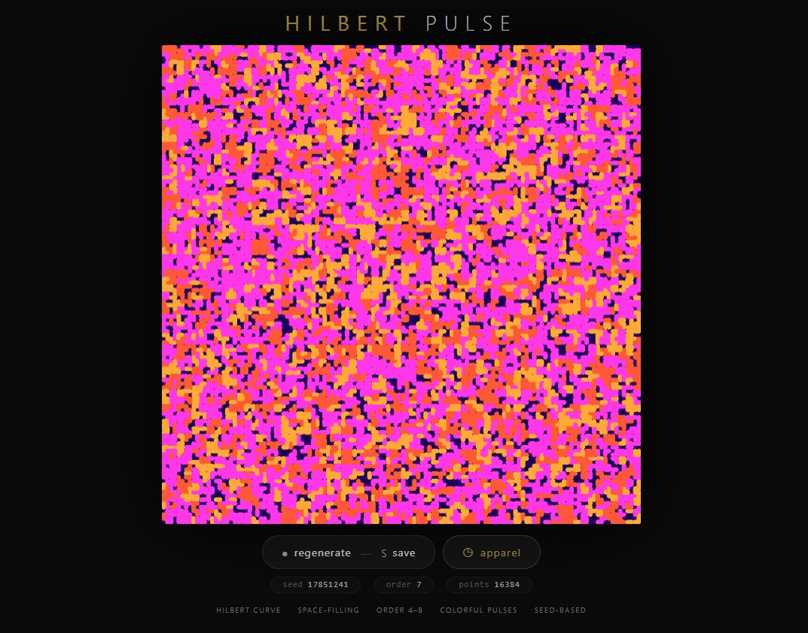
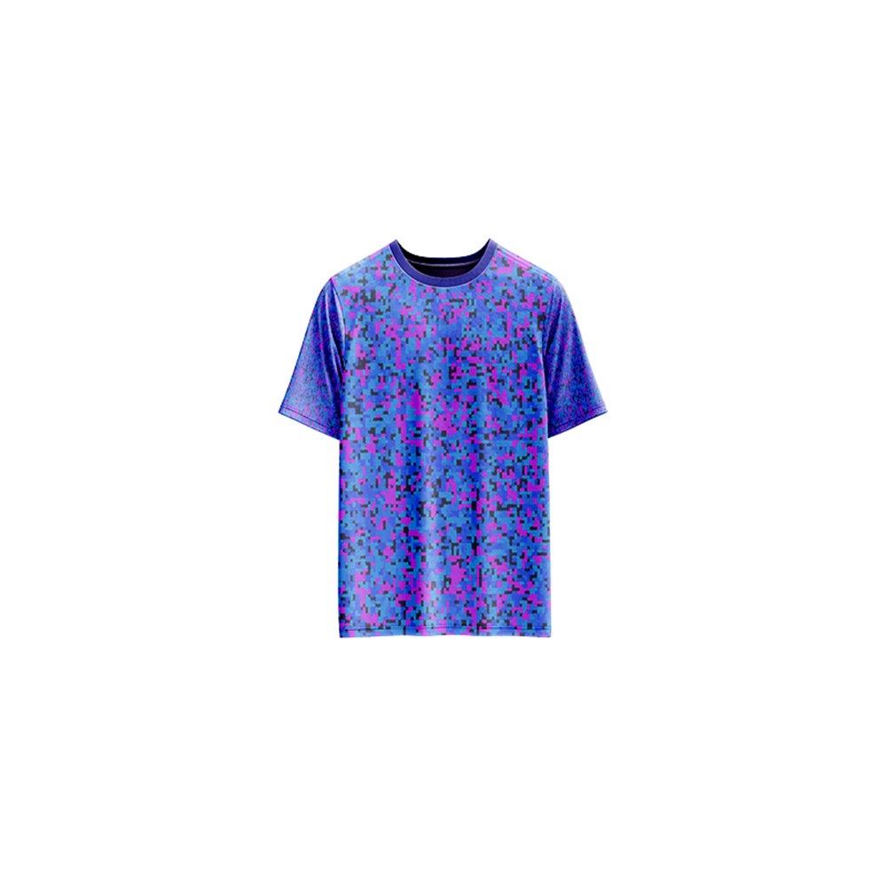

# Hilbert Pulse — Generative Art

[](https://reyrove.github.io/Hilbert-Pulse-Generative-Art)
[](https://opensource.org/licenses/MIT)

> **Generative Hilbert curve art.** Each refresh creates a unique space-filling Hilbert curve with harmonious color palettes, dark backgrounds, and organic line breaks.

## 🎨 Live Demo

<div align="center">
  <a href="https://reyrove.github.io/Hilbert-Pulse-Generative-Art" target="_blank">
    
  </a>
  <br><br>
  <a href="https://reyrove.github.io/Hilbert-Pulse-Generative-Art" target="_blank">
    
  </a>
  <br>
  <em>Click the image or button to experience the generative art</em>
</div>

## 👕 Apparel Preview

<div align="center">
  
  <br>
  <em>Hilbert Pulse artwork printed on a T-shirt</em>
</div>

## ✨ Features

- **Hilbert Curve** — Classic space-filling fractal curve
- **Harmonic Palettes** — 4 random harmonious colors per artwork
- **Line Breaks** — Organic breaks in the curve for visual interest
- **Random Transformations** — Rotation and scaling variations
- **Dark Backgrounds** — Rich HSB dark color palettes
- **Seed-Based** — Every composition is unique and reproducible via its seed
- **Save & Share** — Download as PNG with seed in filename
- **Apparel Mode** — Preview artwork on a T-shirt mockup
- **Responsive** — Works on desktop, tablet, and mobile
- **Pure JavaScript** — No external dependencies
- **Keyboard Shortcuts**:
  - `R` — Regenerate
  - `S` — Save image
  - `T` — Toggle apparel view

## 🎨 Artwork Details

| Parameter | Range | Description |
|-----------|-------|-------------|
| **Curve Order** | 4–8 | Hilbert curve complexity |
| **Total Points** | 256–65,536 | Points in the curve |
| **Colors** | 4 per artwork | Harmonious HSB palette |
| **Background** | HSB | Dark, rich colors |
| **Line Breaks** | 40% chance | Organic breaks in the curve |

## 🌀 The Hilbert Curve

The Hilbert curve is a continuous space-filling fractal curve. It has the unique property of visiting every point in a square grid exactly once while maintaining local continuity. The order of the curve determines its complexity:

| Order | Grid Size | Total Points |
|-------|-----------|--------------|
| 4 | 16×16 | 256 |
| 5 | 32×32 | 1,024 |
| 6 | 64×64 | 4,096 |
| 7 | 128×128 | 16,384 |
| 8 | 256×256 | 65,536 |

## 🚀 Quick Start

### Local Development

```bash
# Clone the repository
git clone https://github.com/reyrove/Hilbert-Pulse-Generative-Art.git

# Navigate to the directory
cd Hilbert-Pulse-Generative-Art

# Open in browser
open index.html
# or use a live server
```

### Deploy to GitHub Pages

1. Push to GitHub
2. Go to Settings → Pages
3. Select branch `main` and root folder
4. Your site will be live at `https://reyrove.github.io/Hilbert-Pulse-Generative-Art`

## 🧠 How It Works

The artwork is generated using a deterministic random number generator, seeded by timestamp + random noise. Every refresh:

1. **Setup**:
   - Random Hilbert curve order (4-8)
   - Random dark background (HSB color mode)
   - Random base hue for color palette

2. **Curve Generation**:
   - Hilbert curve recursively generated
   - Points scaled to fit canvas
   - 60% chance to continue line, 40% chance to break

3. **Coloring**:
   - 4 harmonious colors from base hue
   - Random color selection for each segment
   - Smooth, vibrant palette

4. **Rendering**:
   - Dark background
   - Colorful curve with organic breaks
   - Optional rotation and scaling (50% chance)

## 📁 File Structure

```
Hilbert-Pulse-Generative-Art/
├── index.html          # Main application (all-in-one)
├── Hilbert-Pulse.jpg   # T-shirt mockup image
├── fav.svg             # Favicon
├── demo-screenshot.jpg # Website demo screenshot
├── README.md           # This file
└── LICENSE             # MIT License
```

## 🛠️ Tech Stack

- **Pure Vanilla HTML/CSS/JS** — No dependencies
- **Canvas API** — 2D rendering
- **HSB Color Model** — Color generation
- **CSS Flexbox/Grid** — Responsive layout
- **GitHub Pages** — Hosting

## 🎯 Interactive Controls

| Action | Keyboard | Button |
|--------|----------|--------|
| Regenerate | `R` | Click "regenerate" |
| Save Image | `S` | Click "regenerate" |
| Toggle Apparel | `T` | Click "apparel" |

## 🎨 The Creative Process

### Hilbert Curve
The Hilbert curve is a space-filling fractal that creates beautiful, complex patterns. Its recursive nature produces intricate, maze-like paths that are both mathematical and artistic.

### Harmonic Colors
Colors are generated using HSB (Hue, Saturation, Brightness) with harmonious shifts:
- Base hue determines the overall color direction
- Three additional colors shift by 60°, 120°, and 180°
- Brightness and saturation remain high for vibrant results

### Organic Breaks
The curve is broken randomly (40% chance per segment), creating organic, flowing patterns that feel more like drawn lines than perfect mathematical curves.

### Random Transformations
50% of the time, the curve is rotated and scaled, adding variety to the composition.

## 📱 Responsive Design

The application automatically adapts to:
- Desktop screens
- Tablets
- Mobile phones
- Landscape orientation
- Various aspect ratios

## 🤝 Contributing

Contributions are welcome! Feel free to:
- Fork the repository
- Create a feature branch
- Submit a pull request

### Ideas for Contributions:
- Additional curve types
- New color palettes
- Animation features
- Interactive controls
- Performance optimizations

## 📄 License

MIT License — see [LICENSE](LICENSE) file for details.

## 🙏 Acknowledgments

- Inspired by the Hilbert curve and fractal art
- Pure JavaScript implementation
- Special thanks to the creative coding community

---

**Built with ❤️ and space-filling curves**